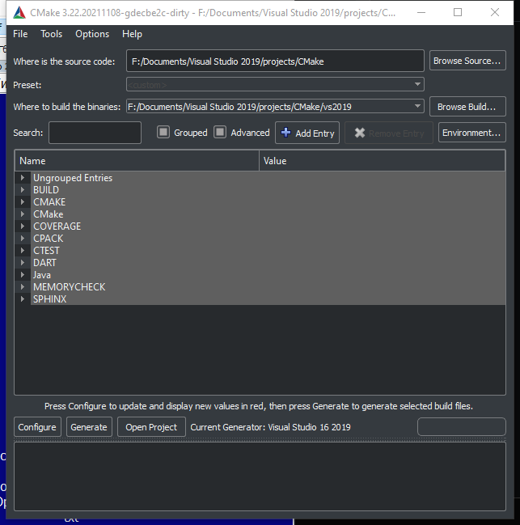

# Cmake Dark Edition

Cmake with dark theme.

Theme files located at Sources/QtDialog/resources/ folder.
You can adjust it as you need.
List items snd regular expressions explorer colors you can find by searching word QColor in Sources/QtDialog folder. 
And adjust them as you want.

